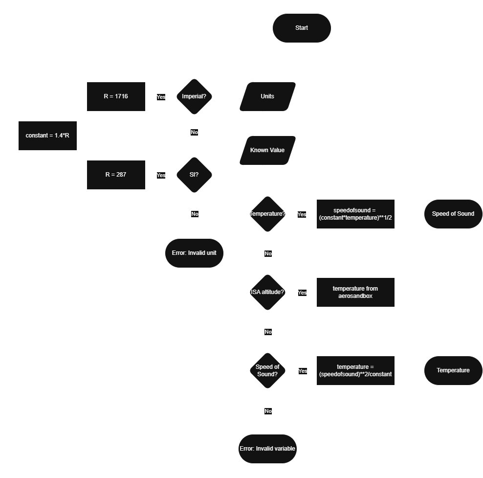

# Speed of Sound Calculator

A physics‑based calculator that determines **speed of sound**, **temperature**, or **ISA‑based atmospheric conditions**, depending on which variable the user provides. Designed for aerospace engineering students, atmospheric modelling practice, and quick engineering checks.

---

## 📘 Overview

This tool supports three core operations:

- **Temperature → Speed of sound**
- **Speed of sound → Temperature**
- **Altitude (ISA) → Temperature → Speed of sound**

You must leave any two inputs blank (using `_`), and the program will compute the missing values automatically.

The project is modular, readable, and easy to extend.

---

## 🧪 Physics Background

The speed of sound in air is given by:


$$
a = \sqrt{\gamma R T}
$$


Where:

- **a** — speed of sound  
- **γ** — ratio of specific heats (≈ 1.4 for air)  
- **R** — specific gas constant  
- **T** — temperature  

Rearranged to compute temperature from speed of sound:


$$
T = \frac{a^2}{\gamma R}
$$


When altitude is provided, the calculator uses the **International Standard Atmosphere (ISA)** model (via AeroSandbox) to determine temperature and then compute the speed of sound.

---

## 🧮 Unit Support

Supports both **SI** and **Imperial** units.

### SI Units
- Temperature: Kelvin (K)  
- Speed of sound: m/s  

### Imperial Units
- Temperature: Rankine (°R)  
- Speed of sound: ft/s  

Gas constants:

- **SI:** R = 287, J/kg·K
- **Imperial:** R = 1716, ft·lbf/slug·°R

Unit conversion is handled automatically.

---

## 🛠️ Features

- Compute **speed of sound from temperature**
- Compute **temperature from speed of sound**
- Compute **speed of sound from ISA altitude**
- Supports unknown values using `_`
- Robust input validation
- Clean separation of UI and physics logic
- Looping interface for repeated calculations

### Planned Enhancements
- Speed‑of‑sound vs altitude plotting  
- Density, pressure, and Mach number calculations  
- Unit conversion utilities  
- GUI or command‑line menu  
- Packaging as a pip‑installable module  

---

## 📊 Flow Diagram


## 📂 Project Structure
```
.
├── .gitignore
├── README.md
├── run.py
│
├── assets/
│   └── SpeedofSound_Calculator-FlowDiagram.png
│
└── speedofsound_calculator/
    ├── calculator.py
    ├── main.py
    ├── plots.py
    └── ui.py

```

## 🚀 Getting Started
Install dependencies:
```
pip install aerosandbox
```
Run the calculator:
```
python speedofsound_calculator/main.py
```

## 📄 License
<<<<<<< HEAD
MIT License - free to use, modify, and learn from.